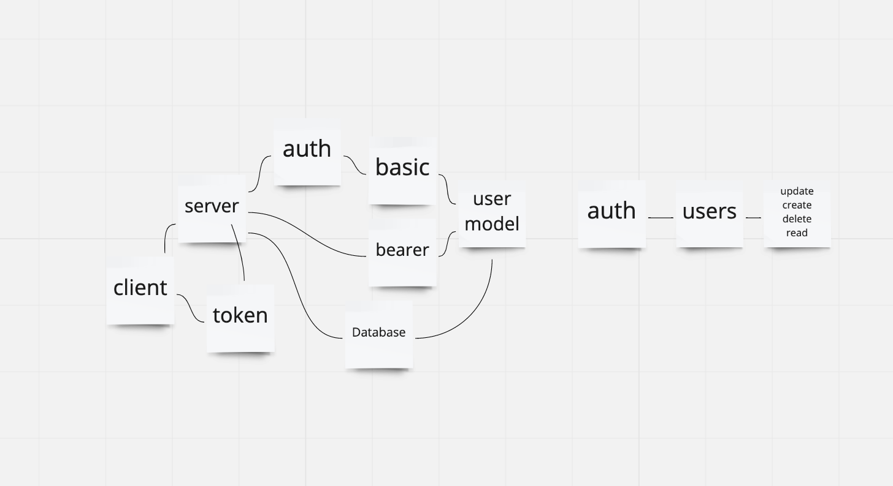

# auth-api

## Installation
`npm install`

## Usage
- `npm start` to run
- `npm test` to test

## Features
- Role Based Access Control

- Being able to login is great. But controlling access at a more granular level is vital to creating a scalable system. In this lab, you will implement Role Based Access Control (RBAC) using an Access Control List (ACL), allowing to not only restrict access to routes for valid users, but also based on the individual permissions we give each user.

- user -> username & password -> access to token 

## Routes
- POST /signup
- POST /signin
- GET /users
- GET /secret

## UML 

## URLS

